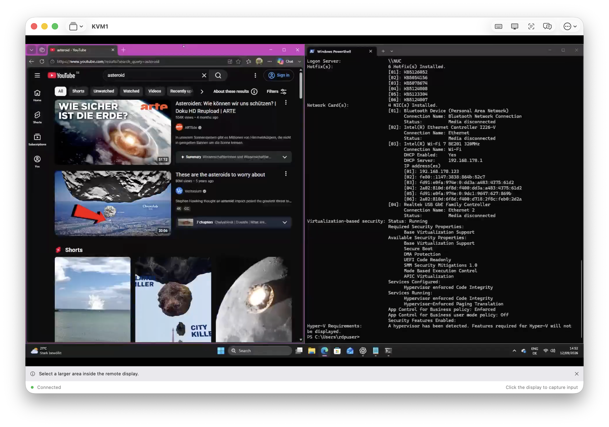
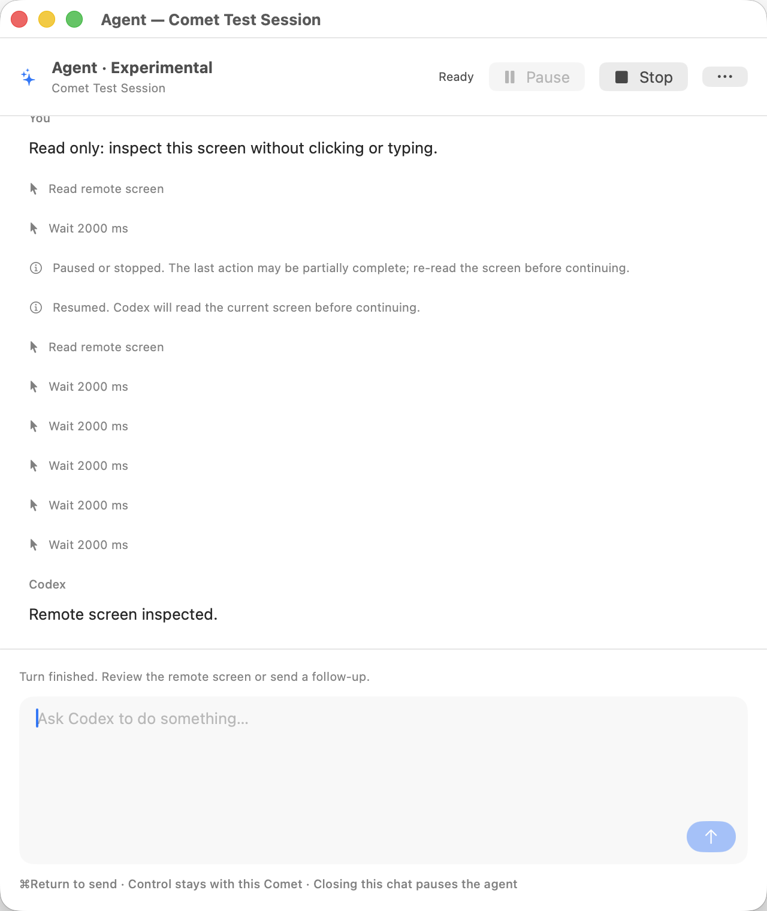

<div align="center">

# AsteroidKVM

**🤖 Agent automation · ⌨️ Native keys · ⚡ Fast rendering**

A native macOS client for GL.iNet Comet / GLKVM.<br>
Control a remote computer yourself, or give Codex a task and watch it work.

**macOS 14+** · **Apple Silicon & Intel builds** · **SwiftUI + AppKit** · **WebRTC + Metal**

[Get started](#get-started) · [🤖 Agent](#agent-give-your-remote-machine-a-task) · [⌨️ Native keys](#native-keys-type-with-your-macs-layout) · [⚡ Fast rendering](#fast-rendering-keep-the-remote-screen-moving) · [Verification](docs/verification.md)

</div>



*The real client connected to a Windows desktop. Keyboard, display, text recognition, and Agent controls stay within reach.*

| 🤖 Agent | ⌨️ Native keys | ⚡ Fast rendering |
| :--- | :--- | :--- |
| Describe a task. Codex reads the screen, clicks, types, and checks the result. Pause or take over whenever you need. | Use the characters resolved by your Mac’s keyboard layout, including umlauts and symbols, with supported Comet firmware. | Native WebRTC, VideoToolbox H.264 decoding, and Metal presentation keep the video path short and frame queues bounded. |

**🌙 Dark mode:** follow your Mac’s appearance or choose Light or Dark in **Settings → Appearance**. Native windows, controls, and Agent chat adapt to your preference.

<a id="agent-give-your-remote-machine-a-task"></a>

## 🤖 Agent: give your remote machine a task

> Create a new text document and write a poem about apples.

Open **Agent**, enter a prompt, and follow the work in a native chat window. Codex sees screenshots from the connected Comet and operates the remote machine through its keyboard and mouse input. Each action returns a fresh screenshot so the next step can respond to what actually happened.

- **See the work:** streamed Markdown replies, code blocks, and a visible action history.
- **Choose permission:** approve each action by default, use observation-only mode, or explicitly grant full control for autonomous work.
- **Stay in control:** Pause/Resume and Stop remain in the chat header. Pause/Resume also appears beside the remote video while the agent is active.
- **Take over naturally:** click the remote display to pause the agent and capture manual input.
- **Resume with context:** Codex reads the current screen before continuing. Closing chat, disconnecting, or sleeping interrupts automation.

**Verified on real hardware:** Codex created a new unsaved Windows Notepad document, wrote a four-line apple poem, and inspected the result. Independent OCR confirmed the test marker in the returned video. [Read the acceptance results →](docs/verification.md#experimental-agent-verification)

<p align="center">
  
</p>

*Actual app capture from the live-screen UI test. This repeatable pause/resume test uses a deterministic agent fixture; real Codex inference is verified separately on the remote computer.*

> **Experimental:** requires an installed, signed-in [Codex CLI](https://developers.openai.com/codex/cli), tested with **0.154.0**. Screenshots and chat go to your configured Codex provider using your existing account and usage limits. Device credentials stay in the KVM client. Enable screen sharing and remote control before the first request.

Full control permits unreviewed actions with the remote user’s privileges, including destructive operations; use approval mode when each step needs review. Agent input supports clicks, double-clicks, key chords, text, scrolling, and waits. Typing is sent character by character, so pausing stops further text; a character already sent may finish. A turn pauses after 150 actions or 15 minutes. [Setup and behavior →](docs/usage.md#experimental-codex-agent)

<a id="native-keys-type-with-your-macs-layout"></a>

## ⌨️ Native keys: type with your Mac’s layout

Your Mac already knows what you meant to type. **Use Native Keyboard Layout** forwards those resolved characters to a compatible Comet daemon, with the remote operating system’s keymap selected in **Keyboard**.

```text
ä ö ü Ä Ö Ü ß    @ €    [ ] { }    \ |
```

Those characters were verified in a real Windows editor using the German target layout. Physical shortcuts retain their USB key identities, including left/right modifiers; physical key repeat remains owned by the remote OS.

The client also includes clipboard text paste, remote keyboard shortcuts, and **local text recognition**: select an area of the remote screen and extract its text with Apple Vision on your Mac.

**Firmware support matters.** Native-layout typing requires the daemon’s `mapped_text` capability and the GLKVM Layout-Aware Typing patch. Standard physical input and paste remain available without it. Choose the keymap that matches the remote OS; use Paste for dead keys and composed text. [Keyboard details →](docs/usage.md#controls)

<a id="fast-rendering-keep-the-remote-screen-moving"></a>

## ⚡ Fast rendering: keep the remote screen moving

Video travels through native WebRTC into a decoder-backed pixel buffer, then into Metal textures for GPU presentation. The supported H.264 path uses VideoToolbox. The mailbox keeps the newest frame, and GPU submissions are bounded so old frames cannot accumulate into a long presentation queue.

| Real Comet sample · 1920 × 1080 | Observed |
| :--- | ---: |
| Received frames per second | **60.45** |
| Presented frames per second | **58.04** |
| Counted CPU frame copies | **0** |
| Decoder | **VideoToolbox** |

*Measured on the test Apple Silicon Mac with a mostly static remote screen. These are observed results, not a throughput or input-latency guarantee. Unsupported buffers can require a counted copy fallback. [Methodology and limits →](docs/verification.md#hardware-measurements)*

Native fullscreen preserves the existing media connection. Fit, Fill, Actual Size, rotation, and Retina-aware input mapping let you choose how the remote desktop occupies your display. Agent screenshots are captured on demand, outside the continuous Metal rendering path.

## Get started

You need **macOS 14 or later**, a reachable **Comet / GLKVM appliance**, and **Xcode** to build. Development and verification used Xcode 26.6. Codex is optional and only needed for Agent.

```sh
# Build the universal, locally signed app.
./scripts/build.sh

# Launch the client.
open build/DerivedData/Build/Products/Release/AsteroidKVM.app
```

You can also open `AsteroidKVM.xcodeproj`, select **AsteroidKVM → My Mac**, and run. Xcode resolves the pinned WebRTC package automatically.

1. **Add your Comet** with its hostname, port, and account.
2. **Connect and click the display** to capture input. The first click captures; subsequent clicks reach the remote machine.
3. **Choose the target keymap** in Keyboard. Enable native-layout typing when supported.
4. **Try Agent:** run `codex login` in Terminal, open Agent in the toolbar, choose its permission mode, enable screenshot/chat sharing, and send a task with **⌘Return**. The default mode asks you to approve each proposed action.

Passwords stay in memory unless you explicitly choose **Remember password in Keychain**. Self-signed certificates require approval of a fingerprint scoped to that device. Each connection owns its credentials, media, and input state.

| Shortcut | Action |
| :--- | :--- |
| **⌃⌥⌘Escape** | Pause agents and release remote input |
| **⌃⌘F** | Toggle native fullscreen |
| **⌘V** | Type clipboard text remotely when paste is enabled |
| **⌘Return** in chat | Send an agent request |
| **⌘Q / ⌘W / ⌘,** | Quit, close, and Settings stay local |

## Tested beyond the happy path

The test suite covers actual HTTP/WebSocket traffic, a native H.264 sender and receiver, Metal presentation, keyboard ordering, local OCR, session isolation, and agent cancellation. Native UI tests exercise the shipped app. Hardware tests use an explicitly supplied session.

```sh
# Local unit and integration tests; hardware/model tests require explicit opt-in.
./scripts/test.sh

# Native macOS UI, including live video and agent pause/resume.
./scripts/test.sh --ui-hardware

# Real Codex against an isolated, generated desktop.
./scripts/test.sh --agent
```

**Latest security regression:** 49 tests passed, including the installed model against a synthetic computer; two opt-in hardware tests were skipped. All three native UI tests passed against live Comet video, including action approval. The earlier real-agent scratch-document acceptance is recorded in the verification guide. Hardware tests require a valid session; UI automation requires an unlocked Mac desktop. The [usage guide](docs/usage.md#tests) documents the opt-ins for remote typing and the unsaved-document agent task.

### GitHub Actions

[macOS CI](.github/workflows/macos.yml) runs deterministic unit tests on new pull requests, PR updates, and pushes to **`main`**. Only a push to `main` builds the universal release app, after the tests pass. Download `AsteroidKVM-macOS-universal-<commit>` from the successful run’s **Artifacts** section; it contains the zipped app and a SHA-256 checksum. Builds are ad-hoc signed and retained for 14 days.

Run the same unit selection locally with `./scripts/test.sh --unit`; it includes adversarial agent tests and local TLS/redirect fixtures. [Security fixes and remaining limits →](docs/security.md) Hardware, native GPU/video integration, interactive UI, and real Codex tests remain explicit local test commands. The workflow uses macOS 26 and Xcode 26.6; pushes to other branches do not trigger it.

## Built to stay understandable

| Module | Responsibility |
| :--- | :--- |
| `CometCore` | Device protocol, profiles, credentials, input ordering, and geometry |
| `CometMedia` | WebRTC, decoder frames, Metal rendering, and local OCR |
| `CometAgent` | Codex transport, conversation state, and bounded remote actions |
| `CometSession` | Per-device lifecycle and the adapter connecting agent actions to KVM input |
| `CometApp` | Native windows, settings, remote display, and chat |

[Architecture](docs/architecture.md) · [Usage guide](docs/usage.md) · [API compatibility](docs/api-compatibility.md) · [Verification](docs/verification.md) · [Specification](docs/spec.md)

### Current boundaries

H.264 is the primary supported video path; HEVC decoding, direct-stream transport, and FEC are unavailable. Native mapped typing is paced for reliable USB delivery on the tested firmware. Intel binaries build, but hardware acceptance was performed on Apple Silicon. Agent behavior depends on the model and an experimental Codex protocol. Local builds are ad-hoc signed; Developer ID signing and notarization are separate distribution steps.
