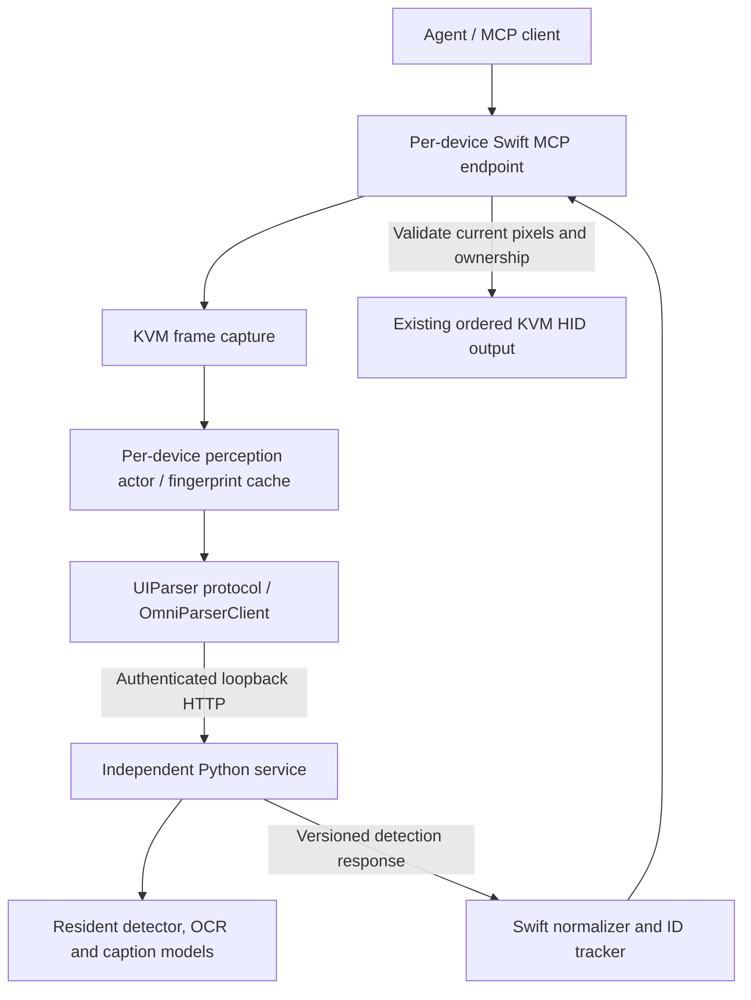

# Local perception architecture

The `UIParser` boundary accepts an immutable `PerceptionFrame` and returns versioned, validated observations. The current implementation uses URLSession; a future CoreML or different local parser can implement the same protocol. Neither the normalized public schema nor `screen.*` tool names expose OmniParser-specific types.

The Python service accepts a JPEG/PNG body at `/parse` and returns normalized model boxes and raw semantic observations. Swift validates schema version, SHA-256 image identity, dimensions, coordinate bounds, finite confidences, text limits, and element counts. It converts coordinates, preserves text/captions, merges only unambiguous duplicate observations, infers a few types from explicit caption evidence, assigns IDs, associates geometrically unambiguous labels, and links recognized containers to children. Raw observations and original detector metadata remain in the single cached response; they are not part of MCP's schema.

**Identity:** the service echoes the SHA-256 of the exact uploaded bytes. Public parsed frame IDs combine that hash with a per-store generation and parse sequence. This also prevents an old element ID from accidentally addressing a newly numbered element when parser settings change but screenshot bytes are identical. A cache hit returns the original parsed frame ID and timestamp.

**Caching:** full-resolution opaque RGBA fingerprints are compared in 32×32-pixel tiles. Differences up to eight intensity levels per channel are ignored as compression noise; a tile exceeding the configured changed-pixel fraction invalidates the full parse. Small dialogs or control changes cannot be diluted by a large unchanged screen. The cache is bounded to one frame/result per device. Availability is checked even for cache hits. A future dirty-region strategy can replace this comparison/invalidation stage without changing MCP.

**Tracking:** one-to-one matches require compatible type/interactivity, equal text/caption semantics, and high IoU. Empty-semantic elements require stricter overlap. Ambiguous matches get fresh, monotonically allocated IDs. Resolution and lifecycle changes clear tracking. IDs are aids to reference within an exact frame, never permission to act without validation.

**Actions:** an MCP peer must first obtain the referenced parsed frame. Immediately before input, Swift captures a new frame and compares it to the cached original, using a changed-pixel threshold no higher than 1% per tile. Resolution changes, unknown frames, and material pixel changes return `STALE_FRAME` with expected/current identifiers. A stale check invalidates the cache so the next inspection reparses. Input starts only after validation, on the main actor, through the existing exclusive lease and HID queue. Type-into-element validates all arguments before its focus click, then observes cancellation/ownership while waiting and typing. Scroll moves the pointer without clicking arbitrary content.

This is conservative visual change detection, not a transaction with the remote OS. Pixels can change immediately after validation; sub-threshold differences may be missed. Model boxes, captions and interactivity may also be wrong. Unknown or ambiguous fields should use the raw-image escape hatch and existing input tools after inspection.

**Installation and lifecycle:** the app bundles the Python service and its versioned install manifest, and downloads a checksum-verified standalone Python runtime plus hash-locked binary dependencies and pinned models only on explicit Install/Update. Staged installations live in Application Support; an atomic active record changes only after verification. `LocalParserManager` holds an interprocess ownership lock during installation or service execution, launches one app-owned child, checks readiness, supports Stop/restart, and terminates it on app exit. The service watches its parent for unexpected app exit. Optional app-start startup performs no downloads. Advanced users can select an external daemon, which the app neither launches nor terminates. The loopback socket binds before model loading to reject occupied ports. Configuration generations and session interruption invalidate in-flight parses/caches.

**Privacy and bounds:** both listeners are loopback-only. The parser requires a separate bearer token, rejects browser Origin headers, and caps incoming bodies at 20 MiB, dimensions at 8192 per axis / 32 megapixels, concurrent connections at 16, and inference concurrency at one. Swift rejects redirects and proxy use, bounds parser responses to 8 MiB / 2,000 elements, and applies configurable request deadlines. Model downloads occur only in explicit setup. The service performs no external inference calls and enables offline loading/network guards. A connected MCP client receives the structured text it explicitly requests and controls where it sends that content; the app cannot govern an external client's cloud usage. Only explicit raw-image tools return screenshots.
